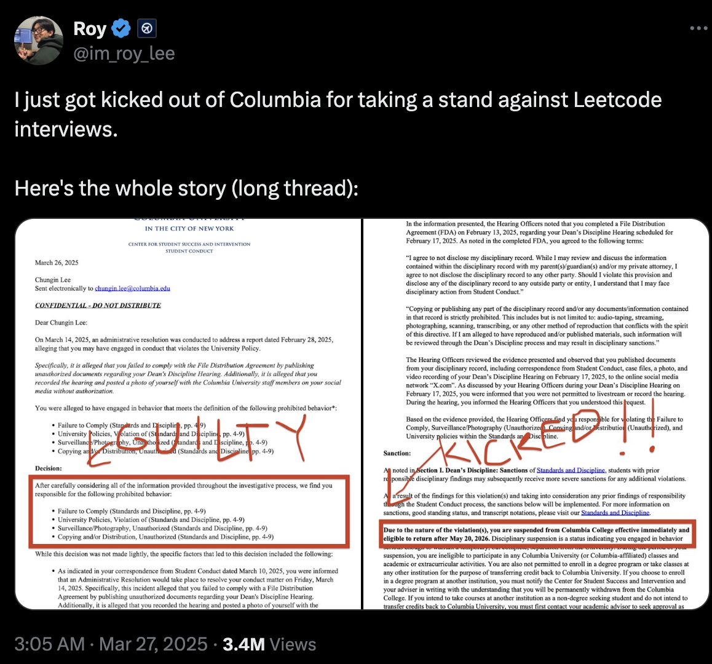

# Debrief: What Actually Happened

Roy Lee was incredibly successful at launching a viral marketing campaign. He released real footage of himself using the software in technical interviews with Amazon, Meta, and several other companies, along with official letters confirming he landed the jobs.

The video was later taken down after companies expressed outrage. Amazon representatives even contacted Columbia University, where Roy was a student. This resulted in his suspension for a **“breach of academic honesty.”**

Roy [posted the official expulsion letter to Twitter](https://x.com/im_roy_lee/status/1905063484783472859), which made the product go even more viral and generated significant revenue from a surge of new users.

However, this backlash pushed the companies involved to update their cheating detection systems. Soon, users started getting blacklisted from companies where they had interviewed.

The team behind [Interview Coder](https://www.interviewcoder.co/) consisted of just two people, leaving them unable to provide adequate customer support.  
Negative reviews from frustrated users began spreading online, and the founders burned bridges with major tech companies. The project was ultimately rejected by Y Combinator.

---

## Discussion

- Look back at your original decision. Has your opinion changed?  
- What would you do in this situation if you were Roy’s cofounder?  

---

## The Story Continues

Despite — or perhaps because of — the backlash, Roy and Neel went on to raise **$15 million** for a new SaaS product called **Cluely**.  

Their new motto?  
> **“Cheat on everything.”**
