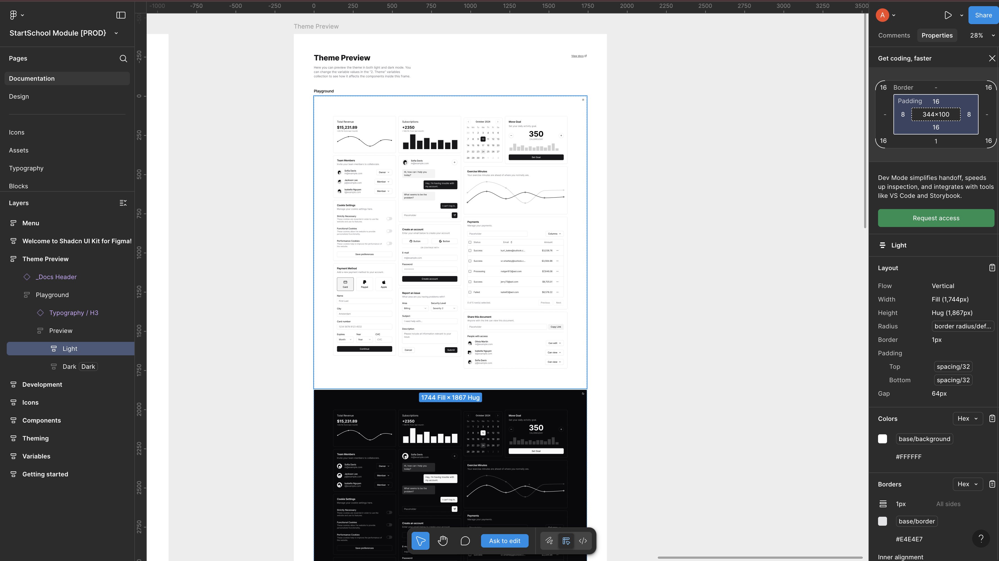
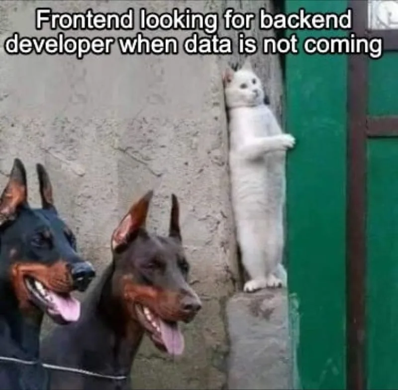

# Career & Collaboration as a Frontend Developer

Frontend developers don’t work alone — they are part of a team.  
Here’s who they work with:

---

## Designers 
- **Who they are**: People who make websites look awesome (colors, buttons, fonts).  
- **How we work together**:  
  - Turn their designs into real websites.  
  - Ask questions if something is unclear.  
  - Suggest ideas to make websites easier to use.  

---

## Backend Developers 
- **Who they are**: People who make websites work behind the scenes (databases, servers, data).  
- **How we work together**:  
  - Connect the website to data (like showing products).  
  - Agree on how frontend and backend talk to each other.  
  - Report issues if something breaks.  

---

## Project Managers 
- **Who they are**: People who organize the project and keep everyone on track.  
- **How we work together**:  
  - Get tasks and deadlines.  
  - Give realistic time estimates.  
  - Update them on progress and problems.  

---

## Summary
Being a frontend developer is all about **teamwork**:  

- Designers make it look great.  
- Backend developers make it work.  
- Project managers keep everyone in sync.  

Together, they build websites that are **cool, useful, and fun to use**.
