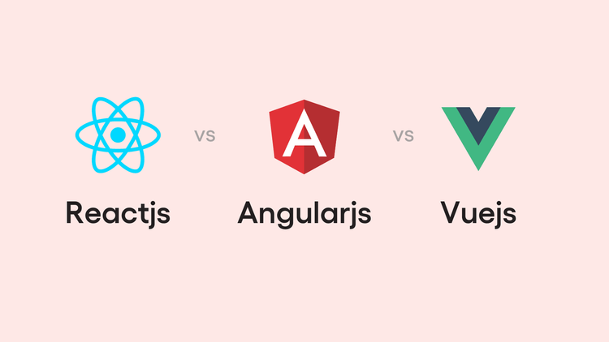

# Frameworks & Tools (Simple Guide)

## What Are Frameworks?
A **framework** is like a set of building blocks.  
Instead of building everything from scratch, you use these blocks to make websites faster.

- **React** → Lego blocks for websites (very popular).  
- **Vue** → Easy-to-use building kit.  
- **Angular** → A full toolbox with everything included.  

---

## CSS Frameworks
CSS frameworks help with the **look** of the website (colors, buttons, layouts).  
It’s like having a fashion designer for your page.

- **Tailwind CSS** → You pick ready-made styles (like stickers).  
- **Bootstrap** → Pre-styled buttons, grids, and menus.  
- **Bulma** → Clean and modern outfits for websites.  

---

## How Browsers Show a Page
When you open a website, your browser (Chrome, Safari, Firefox) does a few steps:

1. **Read the HTML** → Finds out what’s on the page (like reading a recipe).  
2. **Read the CSS** → Learns how it should look (like choosing colors and styles).  
3. **Read the JavaScript** → Figures out how the page should *behave* (like buttons working, animations, or games).  
4. **Build the page layout** → Decides where each element goes (like setting furniture in a room).  
5. **Paint it** → Adds colors, text, and images (like painting a picture).  
6. **Show it to you** → You see the final page!  

---

## Summary
- Frameworks = Building blocks for websites.  
- CSS frameworks = Clothes/styles for websites.  
- Browsers = Read, style, place, paint, and show the page.
