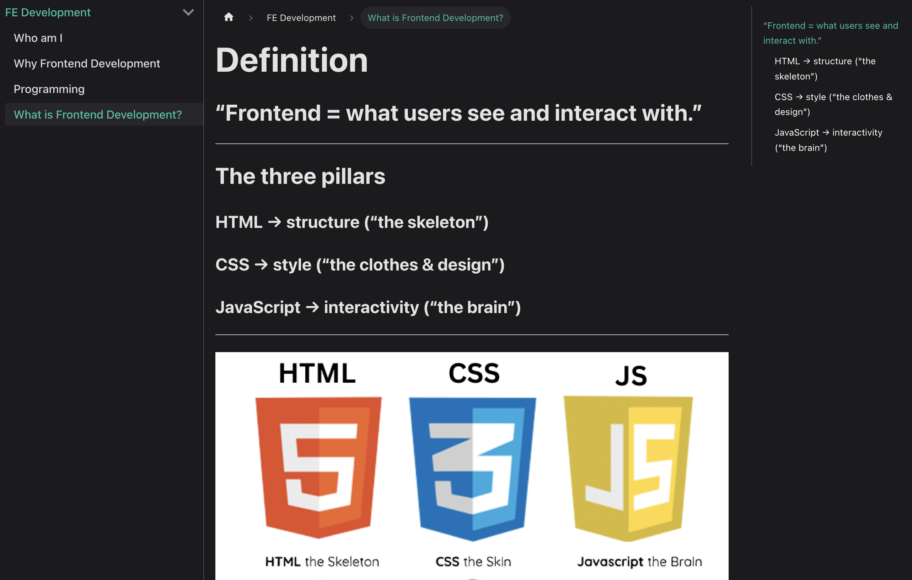
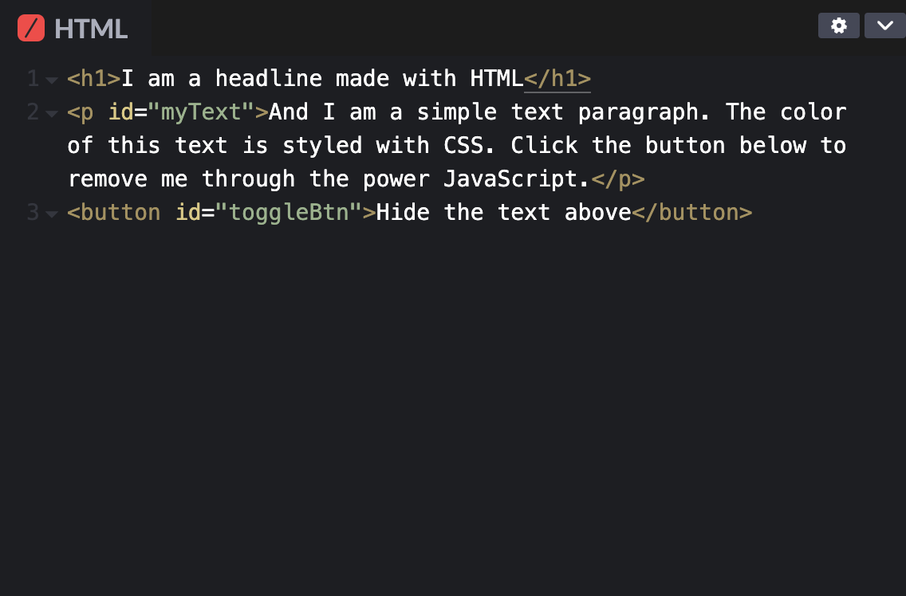
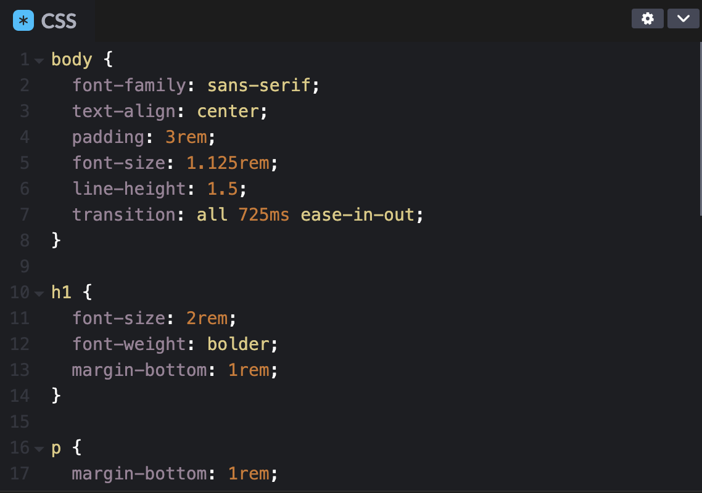
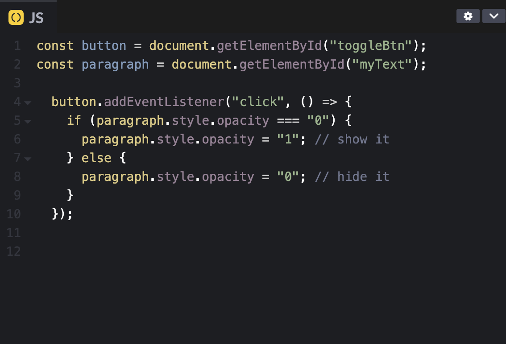

# Definition

## “Frontend = what users see and interact with.”

---

# The three pillars
### HTML → structure (“the skeleton”)

### CSS → style (“the clothes & design”)

### JavaScript → interactivity (“the brain”)

---

# The three pillars - code

---

### [Simple Web App](https://codepen.io/Austra-Marta-Jirgensone/pen/gbPaeYd)

---

